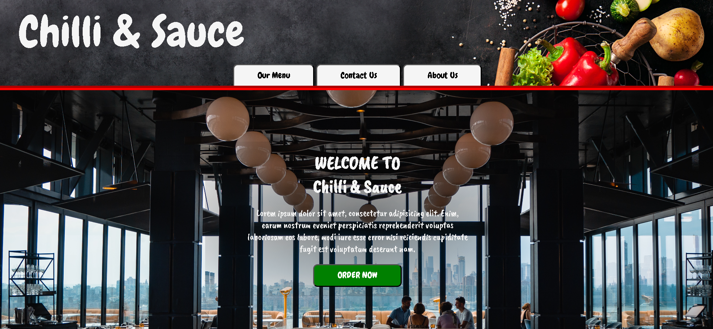
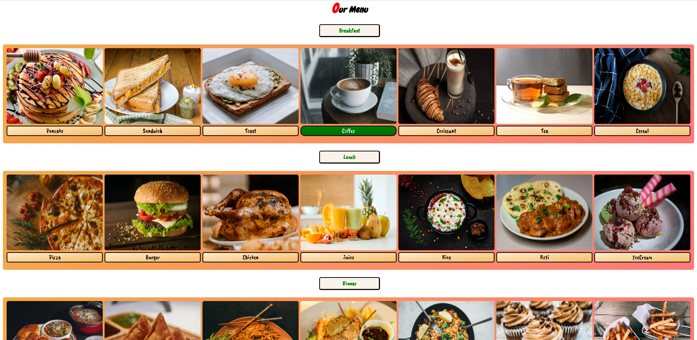
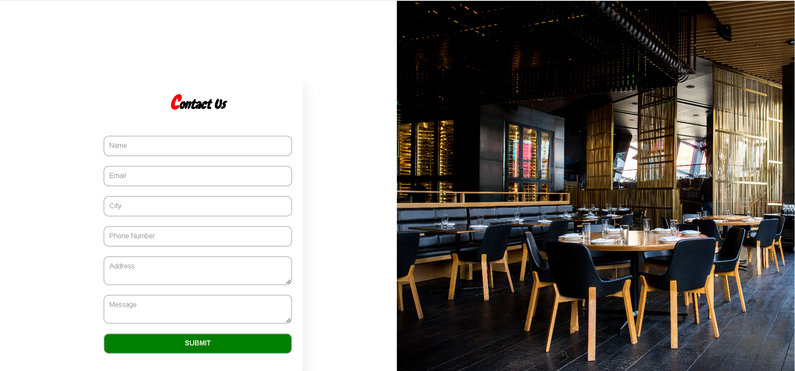
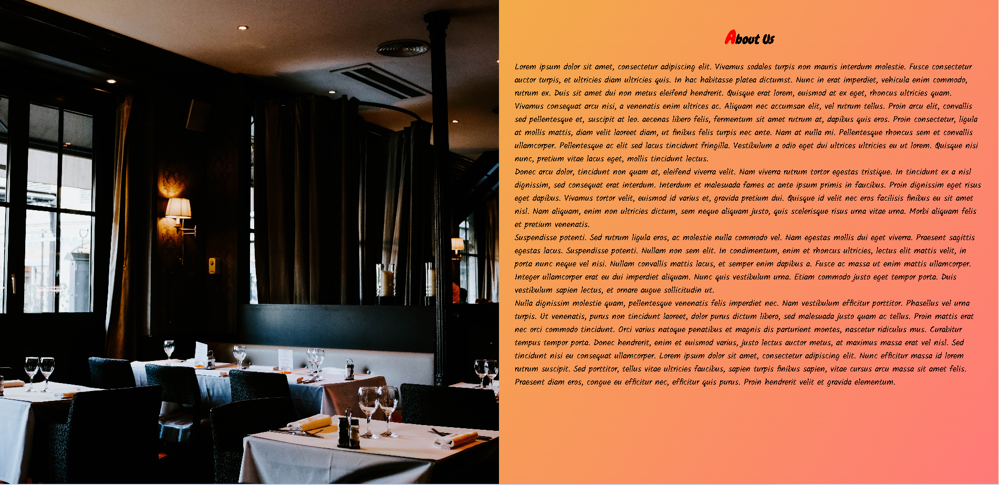

# Chilli & Sauce Restaurant Website

Welcome to the Chilli & Sauce Restaurant Website project!

## Table of Contents

- [Introduction](#introduction)
- [Features](#features)
- [Installation](#installation)
- [Usage](#usage)
- [Screenshots](#screenshots)
- [License](#license)
- [Additional Information](#additional-information)

## Introduction

The Chilli & Sauce Restaurant Website is a static HTML webpage designed to showcase the offerings of a restaurant. It provides visitors with information about the restaurant's menu, contact details, and background. The project aims to create an engaging online presence for the restaurant, enticing potential customers to explore its offerings.

## Features

- **Our Menu**: Displays various food options available at the restaurant, categorized by meal type.
- **Contact Us**: Provides a form for users to submit inquiries or feedback directly to the restaurant.
- **About Us**: Offers information about the restaurant, its background, and mission.
- **Home Page**: Welcomes visitors and introduces them to the restaurant's ambiance and offerings.

## Installation

To run the Chilli & Sauce Restaurant Website locally, follow these steps:

```
git clone https://github.com/your-username/chilli-and-sauce.git
cd chilli-and-sauce
```

## Usage

Users can explore the website to:

- **View the Menu**: Check out the variety of food options available at the restaurant.
- **Contact the Restaurant**: Fill out the contact form for inquiries or feedback.
- **Learn About the Restaurant**: Read about the restaurant's background and mission.
- **Place an Order**: Visit the menu page to explore food options and place an order.

## Screenshots

### Home Page



### Our Menu Page


### Contact Us Page


### About Us Page


## License

This project is not licensed.

## Additional Information

For any questions or further information, please contact [nknithi2018@gmail.com](mailto:nknithi2018@gmail.com).

